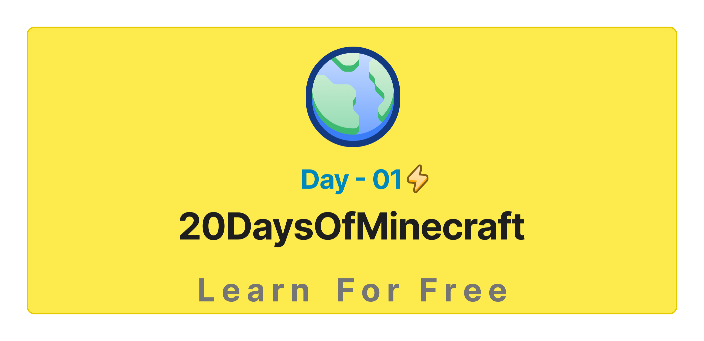

- [📔 Day 1](#-day-1)
	- [Introduction](#introduction)
	- [Requirements](#requirements)
	- [Hosting](#hosting)
		- [The-First-Method](#The-First-Method(On-your-own-Computer/pc))
		- [The Second Method](#The-Second-Method(On-a-Hosting-Website))
	- [Creating Account](#Creating-a-Account)

# 📔 Day 1

## Introduction

**Congratulations** on deciding to participate in 20 days of MinecraftServer challenge. In this challenge you will learn everything you need to be a Minecraft Server Developer, and in general, the whole concept of programming. In the end of the challenge you will get a 20DaysOfMinecraftServer programming challenge completion certificate. In case you need help or if you would like to help others you may join the [Discord](https://discord.gg/4gsJPeqe5N).

**A 20DaysOfMinecraftServer** challenge is a guide for both beginners and advanced Server developers.me to ServerDeveloping. ServerDeveloping is very easy. I enjoy using and teaching ServerDeveloping and I hope you will do so too.

## Requirements

No prior knowledge of programming is required to follow this. You need only:
1. Motivation
2. A computer
3. Internet
4. A browser
5. A Hosting

## Hosting

There are two ways you can host your Server
1. On Your own Computer/VPS etc
2. Online on a Minecraft Server hosting website

### The First Method(On your own Computer/pc)

This is not the best option for you, For some reasons-Note
1. You Need a Computer/Pc for it
2. It atleast have 8GB ram
3. If you ShutDown your Computer/Pc the server will also shutdown 
4. You need a Domain for it also
5. If have lower ram then can't play or do something while server is online
6. Require High Speed Internet Also

### The Second Method(On a Hosting Website)

This is best way, You dont need anything in this. If you have some money then can buy a good server host or other wise can use free host
Some of them are-
1. [Aternos](https://aternos.org/)- Good for them who are begginers
2. [Falix](https://falixnodes.net/)- Good For Pro Developers

**Note** Dont use falix if you dont know nothing about Server Developing becuse there are many option you can get confused After learning you can use.

## Creating a Account
